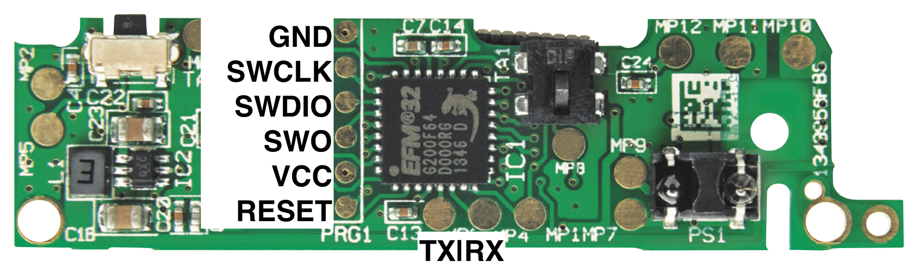

# HM-Sec-SCo-EFM32
Homebrew firmware for the HM-Sec-SCo, that can also be used with an HmIP-SWDO and HmIP-SWDO-I

- [x] EFM32G200F64 Arduino IDE Integration
  - [x] SPI communication with CC1101 module
  - [x] get AlarmClock / Timer working
  - [x] use internal EEPROM (emulated)
  - [x] use external EEPROM (if M24M01 is mounted on pcb)
  - [x] internal vcc measurement
  - [x] external battery measurement
  - [ ] Sleep-Mode
- [x] Unlock SWD interface
- [x] Upload code with ST-Link V2 using [OpenOCD](https://openocd.org)

<hr/>

HM-Sec-SCo PRG Pinout



<hr/>

#### Software part
- **1.)** Install Arduino IDE 1.8.5 or higher
- **2.)** within Arduino IDE install Board-Support "Arduino SAMD Boards (32-bits ARM Cortex-M0+)" _OR_ download the [GNU ARM Embedded Toolchain](https://developer.arm.com/open-source/gnu-toolchain/gnu-rm/downloads) GCC ver 5.4.1-2016q2.
- **3.)** Clone EFM32 Board Support from https://github.com/jp112sdl/ARDUINO_EFM32 to your Arduino folder
- **4.)** Install [OpenOCD](https://openocd.org)

### Hardware part
- **1.)** Connect ST-LinkV2 to the PCB using 4 wires (GND, 3.3V, SWCL, SWDIO)
- **2.)** Unlock SWD access
  - start OpenOCD with `openocd -f interface/stlink-dap.cfg -f target/efm32.cfg`
  - connect to openocd using `telnet localhost 4444`
  - unlock with 
 ```
efm32.dap apreg 0 0x4 0xcfacc118
efm32.dap apreg 0 0x0 1
efm32.dap apreg 0 0x8
sleep 1000
efm32.dap apreg 0 0x0 2
reset_config none
reset init
```
- **3.)** _for debugging it is helpful to connect a FTDI interface to the TX pin to read serial debug messages_

